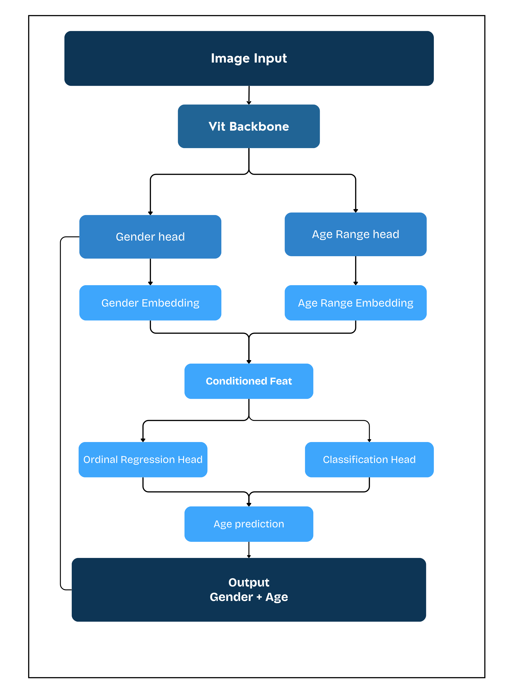

# **AGE ESTIMATION**
> This repository is primarily provided for research and educational purposes. It was developed for a competition organized by the [HUS Applied Mathematics Informatics Club](https://www.facebook.com/toantinhamic) and is also available through the repository: [HAMIC_New_Year_2026_Challenge](https://github.com/HaianCao/HAMIC_New_Year_2026_Challenge).

> The model architecture is primarily designed by the author, with several ideas and references drawn from various existing works and repositories. Details of these resources and contributions can be found in the **[Acknowledgments](#acknowledgments)** section. As a result, the model has not been fully optimized in terms of evaluation metrics.


> For real-world production use, further research or the adoption of more efficient models is recommended. This repository may be updated, extended, or rewritten depending on the future research of the owner.

<div align="center">
    
</div>

## **ABOUT THIS PROJECT**
This project implements a deep learning model designed to predict a person's age and gender from a facial image. The model is first pretrained on the IMDB dataset and then fine-tuned on the UTKFace dataset to improve performance on age estimation tasks.

In addition, the project utilizes the <a href="https://github.com/timesler/facenet-pytorch">MTCNN</a> (Multi-task Cascaded Convolutional Networks) model for face detection and face region extraction before performing prediction.

The primary objective of this project is to accurately estimate the age of individuals depicted in facial images under the best possible conditions while also providing gender classification.

### **BUILT WITH**

* [![Python][Python]][Python-url]
* [![PyTorch][PyTorch]][PyTorch-url]
* [![OpenCV][OpenCV]][OpenCV-url]
* [![Vision Transformer][VisionTransformer]][VisionTransformer-url]
* [![MTCNN][MTCNN]][MTCNN-url]
* [![Pillow][Pillow]][Pillow-url]
* [![NumPy][NumPy]][NumPy-url]


## **UPDATE**

* **09-March-2026 (0.0.1)**: Initial commit with basic prediction script
* **13-March-2026 (0.1.1)**: Added command line interface (CLI) for inference
* **14-March-2026 (0.1.2)**: 
    * *fix*: correct training logic
    * *refactor*: rename variables and reorder calls
    * *feat*: add layer freezing before finetune
    * *perf*: update optimizer

## **INSTALLATION**

This project is developed and tested with **Python 3.11**. Compatibility with other Python versions is not guaranteed. It is recommended to create a virtual environment using Python 3.11 and install the required dependencies.

* Clone the repository:

```
git clone https://github.com/Grizmo2610/AGE-ESTIMATION.git
cd AGE-ESTIMATION
```

* Create a virtual environment:

```
python3.11 -m venv venv
```

* Activate the virtual environment:

Linux / macOS

```
source venv/bin/activate
```

Windows

```
venv\Scripts\activate
```

* Install the required libraries:

```
pip install -r requirements.txt
```

## **MODEL COMPONENTS**

The model contains multiple heads because the task is formulated as a multi-task learning problem. All heads share the same ViT backbone, while each head is responsible for a different prediction objective. These heads include: `Gender Classification`, `Age Range Classification`, `Age Ordinal Regression`, and `Age Classification`.

### **Gender Head**

This head is responsible for predicting the gender of the individual based on facial features extracted by the shared ViT backbone. It performs a binary classification task and outputs the probability of the face belonging to each gender class.

### **Age Range Head**

Instead of directly predicting the exact age, this head classifies the face into a predefined age range. By reducing the output space to several age groups, the model simplifies the age estimation problem and learns more stable high-level age-related features.

### **Age Ordinal Regression Head**

This head models age as an ordered variable rather than a simple categorical label. By learning ordinal relationships between ages, the network captures the natural progression of age and improves the consistency of age-related predictions.

### **Age Classification Head**

This head performs direct age classification by predicting a specific age class from the facial features extracted by the shared backbone. It operates independently but follows a concept similar to the ordinal regression head. This head is one of the two final prediction heads used for age estimation, working alongside the Age Ordinal Regression head to produce the final age-related outputs.

## **MODEL ARCHITECTURE**

The architecture of **AgeNet** is designed as a multi-task learning framework where several prediction heads share the same backbone network. The model takes a facial image as input and processes it through a **Vision Transformer (ViT) backbone** to extract high-level visual features. These shared features are then used by multiple specialized heads to perform different tasks related to gender recognition and age estimation.

First, the extracted features are passed to two parallel branches: the **Gender Head** and the **Age Range Head**. The Gender Head predicts the gender of the individual and produces a **gender embedding**, while the Age Range Head predicts the age group and generates an **age range embedding**. These embeddings provide additional contextual information about the facial characteristics.

<div align="center">
    
</div>


The gender and age range embeddings are then combined to create a **conditioned feature representation**. This conditioning step allows the model to incorporate auxiliary information when estimating age, helping the network learn more structured relationships between gender, age range, and facial features.

From this conditioned feature representation, the architecture branches again into two different age prediction heads: the **Ordinal Regression Head** and the **Age Classification Head**. The Ordinal Regression Head models the ordered nature of age by learning relative age relationships, while the Age Classification Head predicts the age as a discrete class. Both heads contribute to the final age estimation process.

Finally, the outputs from the gender prediction and the age estimation modules are combined to produce the final output: **Gender and Age prediction** for the input face image.


## **PREDICTION CLI**

The `predict.py` script provides a command line interface for running face detection, gender classification, and age prediction using the trained model.

Run the script from the project root:

```bash
python predict.py [OPTIONS]
```

---

## **EXAMPLES**

Run inference on an image:

```bash
python predict.py --image sample/img4.jpg
```

Run inference on an image and display the result:

```bash
python predict.py --image sample/img4.jpg --imshow
```

Save the prediction result:

```bash
python predict.py --image sample/img4.jpg --save
```

Save cropped faces separately:

```bash
python predict.py --image sample/img4.jpg --save --crop
```

Run inference using the default webcam:

```bash
python predict.py --camera 0 --imshow
```

Run inference using an IP / RTSP camera:

```bash
python predict.py --camera rtsp://camera_address --imshow
```

Force the model to run on GPU:

```bash
python predict.py --image sample/img4.jpg --device cuda
```

Adjust padding for cropped faces:

```bash
python predict.py --image sample/img4.jpg --padding 0.3
```

Show program version:

```bash
python predict.py --version
```

---

### **OPTIONS**

* `--image PATH` : run inference on an image
* `--camera ID/URL` : run inference using a camera (webcam index or RTSP URL)
* `--imshow` : display prediction results in a window
* `--save` : save prediction results
* `--save-path PATH` : custom directory for saved outputs
* `--crop` : save cropped face images separately
* `--padding FLOAT` : padding ratio added to face bounding boxes before cropping
* `--device {cpu,cuda}` : select computation device
* `--log-level LEVEL` : logging level (`DEBUG`, `INFO`, `WARNING`, `ERROR`)
* `--version` : display program version
* `--help` : show all CLI options and usage information

## **LICENSE**

Distributed under the Apache License. See `LICENSE.txt` for more information.

## **CONTACT**

Hoàng Tú (Grizmo)- [@tuantu2610](https://www.instagram.com/tuantu2610/) - hoangtuantu893@gmail.com


## **ACKNOWLEDGMENTS**

* Pytorch-Age-Estimation with the ideal for combine feature for multi-task model: [https://github.com/manhcuong02/Pytorch-Age-Estimation](https://github.com/manhcuong02/Pytorch-Age-Estimation)

* HAMIC New year Challenge: [https://github.com/HaianCao/HAMIC_New_Year_2026_Challenge](https://github.com/HaianCao/HAMIC_New_Year_2026_Challenge)


<!-- MARKDOWN BADGES -->

[Python]: https://img.shields.io/badge/Python-3776AB?style=for-the-badge&logo=python&logoColor=white
[Python-url]: https://www.python.org/

[PyTorch]: https://img.shields.io/badge/PyTorch-EE4C2C?style=for-the-badge&logo=pytorch&logoColor=white
[PyTorch-url]: https://pytorch.org/

[OpenCV]: https://img.shields.io/badge/OpenCV-27338e?style=for-the-badge&logo=opencv&logoColor=white
[OpenCV-url]: https://opencv.org/

[VisionTransformer]: https://img.shields.io/badge/Vision%20Transformer-ViT-blue?style=for-the-badge
[VisionTransformer-url]: https://arxiv.org/abs/2010.11929

[MTCNN]: https://img.shields.io/badge/MTCNN-Face%20Detection-green?style=for-the-badge
[MTCNN-url]: https://github.com/timesler/facenet-pytorch

[Pillow]: https://img.shields.io/badge/Pillow-Image%20Processing-orange?style=for-the-badge
[Pillow-url]: https://python-pillow.org/

[NumPy]: https://img.shields.io/badge/NumPy-013243?style=for-the-badge&logo=numpy&logoColor=white
[NumPy-url]: https://numpy.org/
